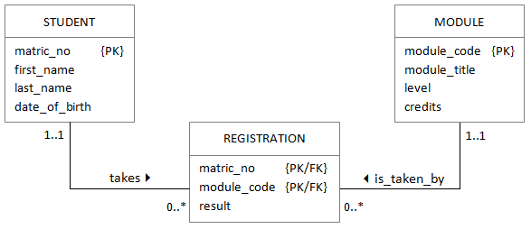

# Student records database

Link to the page - https://sqlzoo.net/wiki/DDL_Student_Records

## Student Records, Logical Design

The database is intended to record the grades of students studying modules at a University.

There are a number of students, identified by a matric number. A typical student is Daniel Radcliffe who has matric number 40001010 and DoB 1989-07-23

There are a number of modules, identified by a module code it also has a module name. A typical module is HUF07101 - Herbology

Each student studies many modules and will get a result for each. Each module is studied by many students.



## SQLite

- Get sqlite from [here](https://sqlite.org/download.html). Don't forget to grab command-line tools.
- Install it somewhere
- Update your PATH variable
- Make it convenient to run sqlite from cmd, e.g. via `sql` shortcut

## The plan

We will create three tables, one for each of the entities in the diagram shown above. Where there is a "parent/child" relation (a one to many) we must create the ONE before we create the MANY. That means we should create the table in the order

    [student, module, registration] ✓
    [module, student, registration] ✓

but not

    [registration, module, student] ✕

## Create database

```cmd
sql .open students.db
```

## Student table

You need to create a table with these columns: matric_no, first_name, last_name, date_of_birth

- The primary key is matric_no. Matric numbers are exactly 8 characters.
- Use up to 50 characters for names.
- There is a specific data type for dates.

```sql
create table student(
    matric_no CHARACTER(8) PRIMARY KEY NOT NULL
    ,first_name VARCHAR(50) NOT NULL
    ,last_name VARCHAR(50) NOT NULL
-- NOTE SQLite doesnt have Date and Time types
-- It will convert DATE type to NUMERIC
    ,date_of_birth DATE NOT NULL
);
```

## Add some students

Add the following students:

- Daniel Radcliffe, matric 40001010 DoB 1989-07-23
- Emma Watson, matric 40001011 DoB 1990-04-15
- Rupert Grint, matric 40001012 DoB 1988-10-24

```sql
-- full suntax to insert ONE row
insert into student
(matric_no, last_name, first_name, date_of_birth)
values
(40001010, 'Radcliffe', 'Daniel', '1989-07-23');

-- short syntax where only values are present
insert into student
values
(40001011, 'Emma', 'Watson', '1990-04-15');

-- inser multiply values
insert into student
values(40001012, 'Rupert', 'Grint', '1988-10-24')
,(40001013, 'Drako', 'Malfoy', '1990-09-10')
;
```

## Module table

A module has the following columns

- module_code (primary key, 8 characters)
- module_title (up to 50 characters)
- level (integer)
- credits (integer default value is 20)

```sql
create table module(
    module_code character(8) PRIMARY KEY
    ,module_title varchar(50) NOT NULL
    ,level INT NOT NULL
    ,credits INT NOT NULL DEFAULT 20
);
```

## Add some modules

Add the following modules, they are all 20 credits - the first two digits let you know the level:

- HUF07101, Herbology
- SLY07102, Defense Against the Dark Arts
- HUF08102, History of Magic

```sql
insert into module
values('HUF07101', 'Herbology', 07, 25),
('SLY07102', 'Defense Against the Dark Arts', 07, 25),
('HUF08102', 'History of Magic', 08, 25),
('MAT08103', 'Math', 08, 20);
```

- NOTE You can use short syntax `INSERT INTO table VALUES(...);` and ommit data for columns with `DEFAULT` constraint. You have to use full syntax `INSERT INTO table(col1,col2) VALUES(val1,val2)`. In such a case you can ommit columns with `DEFAULT` constraint.

## CREATE registration

The registration table has three columns `matric_no`, `module_code`, `result` - the `matric_no` and `module_code` types should match the tables you have just created. `result` should be a number with one decimal place.

**Make sure you include a composite primary key and two foreign keys**.

```sql
create table registration(
    matric_no char(8) NOT NULL,
    module_code char(8) NOT NULL,
    result DECIMAL(10, 1),
    PRIMARY KEY(matric_no, module_code),
    FOREIGN KEY(matric_no) REFERENCES student(matric_no),
    FOREIGN KEY(module_code) REFERENCES module(module_code)
);
```

## Data for registration table

- Daniel got 90 in Defence Against the Dark Arts, 40 in Herbology and does not yet have a mark for History of Magic
- Emma got 99 in Defence Against the Dark Arts, did not take Herbology - and has no mark for History of Magic
- Ron got 20 in Defence Against the Dark Arts, 20 in Herbology and is not registered for History of Magic

```sql
insert into registration
values
(40001010, 'HUF07101', 40),
(40001010, 'SLY07102', 90),
(40001010, 'HUF08102', NULL)
;

insert into registration
values
(40001011, 'SLY07102', 99),
(40001011, 'HUF08102', null)
;

insert into registration
values
(40001012, 'SLY07102', 20),
(40001012, 'HUF07101', 20)
;

-- Drako has 50 in DAtDA and 5 in Math
insert into registration
values
(40001013, 'MAT08103', 5),
(40001013, 'SLY07102', 50)
;
```

## Run some queries

Produce the results for SLY07102. For each student show the surname, firstname, result and 'F' 'P' or 'M'

- F for a mark of 39 or less
- P for a mark between 40 and 69
- M for a mark of 70 or more

```sql
select s.first_name || ' ' || s.last_name as "Student",
        result as "Result",
        CASE WHEN result >= 70 THEN 'M'
             WHEN result BETWEEN 40 AND 69 THEN 'P'
             ELSE 'F'
        END as "Score"
  from registration r
    join student s ON (s.matric_no=r.matric_no)
  where
    r.module_code = 'SLY07102';
```

| Student          | Result | Score |
|------------------|--------|-------|
| Daniel Radcliffe | 90     | M     |
| Emma Watson      | 99     | M     |
| Rupert Grint     | 20     | F     |
| Drako Malfoy     | 50     | P     |

---

## Including historical records

One problem with the existing database is that it does not allow for historical records. In this tutorial you will fix this.

## The table modinst

Modules are run in sessions that are labelled with the `academic year` (for example 2016/7) and the `trimester` (for example TR1). The table modinst records which module is running.

Create the table modinst - be sure to include the foreign key to the module table. The primary key should be all three columns.

```sql
create table modinst(
    module_code char(8) NOT NULL,
    ayr decimal(6,2) NOT NULL,
    tri char(3) NOT NULL,
    foreign key(module_code) references module(module_code),
    primary key(module_code, ayr, tri)
);

-- some rows
insert into modinst values
('HUF08102', 2015.6, 'TR1'),
('SLY07102', 2015.6, 'TR2'),
('HUF07101', 2015.6, 'TR2'),
('HUF08102', 2016.7, 'TR1'),
('SLY07102', 2016.7, 'TR2'),
('HUF07101', 2016.7, 'TR2')
;
```

## ALTER the results* table

* means `registration` table ?

The results table should include the session in which the mark was gained.

All of the marks in the original table were gained in session 2015/6 TR2. The Herbology registration is for 2016/7 TR1.

- Add two columns to the registration table for ayr and tri.
- Set values for these columns as mentioned
- Add a new foreign key from results to modinst

I cannot alter existing constraints, so here is a hack:

- Create new table with desired columns and constraints
- Copy data from an old table to the new table
- Delete old table
- Rename the new table to the old table name

```sql
-- new table with new constraints
create table reg_new(
    matric_no char(8) NOT NULL,
    module_code char(8) NOT NULL,
    result DECIMAL(10, 1),
    ayr decimal(6,2) not null,
    tri char(3) not null,
    PRIMARY KEY(matric_no, module_code),
    FOREIGN KEY(matric_no) REFERENCES student(matric_no),
    FOREIGN KEY(module_code) REFERENCES module(module_code),
    foreign key(module_code, ayr, tri) references modinst(module_code, ayr, tri)
);

-- copying an old data
insert into reg_new
  select * from registration
    join (select 2015.6 as ayr, 'TR2' as tri) ON true
;

-- updating with new conditions
update reg_new
  set ayr = 2016.7,
      tri = 'TR1'
  where module_code != 'HUF07101';

-- drop old and rename
drop table registration;
alter table reg_new RENAME TO registration;
```